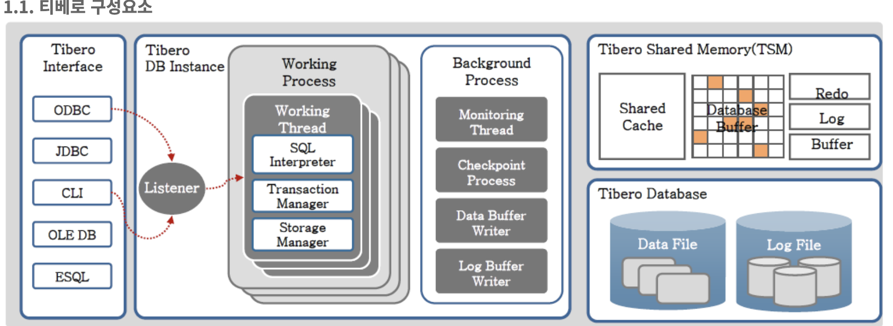

목자

1. [티베로 전체적 구조](#티베로-전체적-구조)
2. [티베로 데이터베이스 저장 구조](#티베로-데이터베이스-저장-구조)
3. [티베로 db instance 구조](#db-instance-구조)

---

# 티베로 DB 구조

## 티베로 전체적 구조

1. 리스너
    - odbc, jdbc 드라이버와 같은 db 인터페이스 드라이버와 워킹 프로세스가 통신이 가능하도록 하는 프로세스
    - 새로운 접속 요청을 유휴 워커 프로세스에 할당함
    - 모니터 프로세스에 의해 생성됨
2. [워커 프로세스](#워커-프로세스)
    - 실제 통신을 하며 클라이언트의 요구사항을 처리하는 프로세스
    - 기본적으로 하나의 워커 프로세스 안에는 **1개의 컨트롤 스레드와 10개의 워커 스레드**가 존재한다.
3. [백그라운드 프로세스](#백그라운드-프로세스)
    - 워커 스레드나 다른 백스라운드 프로세스가 요청할 때나 주기적으로 동작함
    - 주로 메모리와 오래걸리는 디스크에 접근하는 동작 수행하는 독립 프로세스
    - 사용자의 요청과 비동기적으로 동작
4. 메모리 영역
    - TSM(tibero shared memory)
        - 인스턴스에 대한 데이터와 제어 정보를 가지는 공유 메모리 영역
        - 사용자가 동시에 데이터를 공유
        - database buffer, redo log buffer, sql cache, data dictionary cache로 구성
        - TSM은 사용자가 요청한 쿼리의 실행 계획을 저장하고, 요청한 데이터를 블록단위로 저장함
        - Background Process는 인스턴스가 시작될 때 TSM 영역을 할당하고, 인스턴스가 종료하면 할당 해제
        - 블록 단위의 데이터를 db 사용자 간에 공유하여 db 사용 성능 향상을 위한 영역
    - PGA
        - 워킹 프로세스가 사용자로부터 받은 요청 결과를 정렬하는데 주로 사용됨
        - DB 사용자 간에 공유하지 않는 영역
        - 유의 사항
            - PGA 메모리 크기
                - 너무 작을 경우 메모리 공간이 부족하여 사용자가 접속이 안될 수 있음
5. 파일(tibero database)
    - 컨트롤 파일
        - 데이터베이스 자체의 메타 데이터를 갖고 있는 파일
        - db가 필요로 하는 파일의 정보를 갖고 있음
    - 데이터 파일
        - 실제 데이터를 가지고 있는 파일
    - 로그 파일
        - db에서 수행한 모든 변역 내역을 가지고 있는 파일
        - media/cache recovery 등의 복구 행위를 할 때 사용

### 클라이언트 접속 과정

1. 클라이언트가 접속을 요청
2. 리스너가 현재 유휴한 워커 스레드가 있는 워커 프로세스를 찾아서 클라이언트의 접속 요청(①)을 한다.
    1. 이때 File descriptor와 함께 할당되므로 클라이언트는 서버의 내부 동작과 상관없이 마치 처음부터 워커 스레드에 접속한 것처럼 동작하게 된다.
3. 리스너의 요청을 받은 컨트롤 스레드(CTHR: control thread)는 자기 자신에 속한 워커 스레드의 상태를 검사(②)하여 현재 유휴한 워커 스레드에 클라이언트의 접속을 할당(③)한다.
4. 워킹 스레드는 클라이언트와 인증 절차를 거쳐 세션 시작
- CTHR (Control Thread)
    - 각 Working Process마다 하나씩 생성. 서버 시작 시에 지정된 개수의 Worker Thread를 생성
    - 시그널 처리 담당
    - I/O Multiplexing을 지원하며, 필요한 경우 워커 스레드 대신 메시지 송/수신 역할 수행
- WTHR (Worker Th-read)
    - 각 Worker Process마다 여러 개 생성
    - client가 보내는 메시지를 받아 처리하고 그 결과를 리턴
    - SQl Parsing, 최적화, 수행 등 DBMS가 해야 하는 대부분의 일 처리

---

## 워커 프로세스

- 클라이언트와 실제로 통신을 하며 사용자의 요구 사항을 처리하는 프로세스
- Tibero 6부터 워커 프로세스는 용도에 따라 두 그룹으로 나눌 수 있음
    1. 포어그라운드 워커 프로세스(Foreground Worker Process)
        - 리스너를 통해 들어온 온라인 요청을 처리
    2. 백그라운드 워커 프로세스(Background Worker Process)
        - 인터널 태스크(Internal Task)나 잡 스케줄러에 등록된 배치 작업을 수행
        - 그룹은 `MAX_BG_SESSION_COUNT` 초기화 파라미터로 조절
- 스레드 기반 작업 수행
- 프로세스의 개수
    - `WTHR_PROC_CNT` 초기화 파라미터로 조절
    - Tibero가 기동된 뒤에는 변경 불가
    - 시스템 환경을 고려하여 적절한 값을 설정해야 함
- 세션
    - 서버에서 제공하는 세션의 수는 프로세스 수와 프로세스 별 스레드 수에 곱이 된다.
    - 프로세스나 스레드 조절은 세션 수를 조절하는 것을 권장

### - 구성

1. 컨트롤 스레드
    - Tibero가 기동될 때 초기화 파라미터에 설정된 수만큼 워커 스레드를 생성한다.
    - 클라이언트의 새로운 접속 요청이 오면 현재 유휴한 워커 스레드에 클라이언트의 접속을 할당한다.
    - 시그널 처리를 담당한다.
    - Tibero 6부터 **I/O multiplexing을 지원**하며 필요한 경우 워커 스레드 대신 **메시지를 보내거나 받는 역할을 수행**한다.
2. 워커 스레드
    - 클라이언트와 1:1로 통신
    - 클라이언트가 보내는 메시지를 받아 처리 및 그 결과 반환
    - SQL 파싱, 최적화 수행 등 DBMS가 하는 작업 대부분 수행
    - 워커 스레드는 하나의 클라이언트와 접속
        - Tibero에 동시 접속이 가능한 클라이언트 수 : `WTHR_PROC_CNT` * `_WTHR_PER_PROC`
        - 즉 세션 수만큼 접속 가능
        - 접속이 끊겨도 스레드를 종료하지 않고 유지하기 때문에 접속이 빈번하더라도 성능 저하가 없음
        - 실제 클라이언트 접속 수가 적더라도 운영체제가 하나의 스레드를 유지하는데 드는 리소스가 적기 때문에 운영 상 무리가 없음
    - 주의
        - 많은 수의 워커 스레드가 작업할 경우 운영체제에 과도한 부하가 발생
        - 대규모 시스템을 구축할 때는 tibero와 클라이언트의 애플리케이션 프로그램 사이에 미들웨어를 설치하여 3-tier 구조로 시스템을 구축할 것을 권장

--- 

## 백그라운드 프로세스

- 클라이언트의 접속 요청을 직접 받지 않고 워커 스레드나 다른 백그라운드 프로세스가 요청할 때 또는 정해진 주기에 따라 동작하는 주로 시간이 오래 걸리는 디스크 작업을 담당하는 독립된 프로세스

### - 프로세스 구성

- 감시 프로세스(MPROC: monitor process)
    - Tibero 6부터 영문 약자가 스레드에서 프로세스로 변경
    - 실제로 하나의 독립된 프로세스
    - Tibero가 기동할 때 최초로 생성되며 Tibero가 종료하면 맨 마지막에 프로세스를 끝마침
    - Tibero가 기동할 때 **리스너를 포함한 다른 프로세스를 생성**하거나 **주기적으로 각 프로세스의 상태를 점검**하는 역할을 담당
    - **교착 상태(deadlock)도 검사**
- Tibero 매니저 프로세스(TBMP)
    - 시스템을 관리하기 위한 용도.
    - 관리자의 접속 요청을 받아 이를 시스템 관리 용도로 예약된 워커 스레드에 접속을 할당
    - 기본적으로 워커 프로세스와 동일한 역할을 수행하지만 리스너를 거치지 않고 스페셜 포트를 통해 직접 접속을 처리
    - SYS 계정만 접속이 허용됨. 로컬에서만 접속 가능
- 에이전트 프로세스(AGNT : agent process)
    - 시스템 유지를 위해 주기적으로 처리해야 하는 Tibero 내부의 작업을 담당
    - Internal Task나 Batch Job이 언제 수행되어야 하는지 판단은 AGENT 프로세스가 담당 하지만, **실제 수행은 포어그라운드 혹은 백그라운드 워커 프로세스에게 의뢰하는 구조**
    - 6부터 AGNT로 명칭이 변경
    - Tibero 6부터 다중 스레드(multi-threaded) 기반 구조로 동작
    - 서로 다른 용도의 업무를 스레드별로 나누어 수행
- 데이터베이스 쓰기 프로세스(DBWR)
    - 데이터베이스에서 변경된 내용을 디스크에 기록하는 일과 연관된 스레드들이 모여 있는 프로세스
    - 구성
        1. 사용자가 변경한 블록을 디스크에 주기적으로 기록하는 스레드
        2. Redo 로그를 디스크에 기록하는 스레드
        3. 두 스레드를 통해 데이터베이스의 체크포인트 과정을 관할하는 체크포인트 스레드
- 복구 프로세스 (RCWP: recover worker process)
    - 복구 전용 프로세스
    - Crash / Instance recovery 수행

--- 

## 데이터베이스 저장 구조

### - 티베로 데이터베이스 저장 구조

    
### 1. 티베로 데이터베이스 구조(물리 저장 구조)

- 티베로 데이터베이스 파일
    1. [data files](#datafiles)
        - 테이블, 인덱스 등 로지컬 스트럭쳐들의 물리적 데이터가 저장되는 파일
    2. redoLog files
        - 복구를 위해 데이터베이스에서 변경된 모든 것을 기록하는 파일
    3. control files
        - 데이터베이스의 물리적 구조와 상태를 기록하는 파일

- 티베로 데이터베이스 파일 저장 방식
    - 운영체제의 파일 시스템
        - 일반적으로 파일시스템은 논리볼륨관리자, LVM에 의해 생성된 논리볼륨을 기반으로 구축되어 있음
        - LVM은 서로 다른 물리적 디스크 영역을 하나의 연속된 주조 공간으로 결합하여 제공함
    - Tibero Active Storage(TAS)
        - 티베로 데이터베이스에서 사용하는 전용 파일시스템
        - 티베로 TAC 환경에서 TAS를 기반으로 데이터베이스를 생성하여 운영할 수 있음
        - 데이터베이스 파일을 관리하고 I/O 작업을 수행
    - RAW 장치
        - 파일 시스템으로 포맷되어 있지 않은 디스크 파티션이나 논리 볼륨
        - 파일 시스템을 거치지 않고 직접 I/O를 수행
    - 클러스터 파일 시스템
        - 여러 컴퓨터 간에 파일 저장소를 공유하는 기능을 제공
        - Tibero TAC 환경에서는 클러스터 파일 시스템을 기반으로 데이터베이스를 생성하고 운영

### datafiles

구조

- 데이터베이스 데이터가 저장됨
- tablespace는 하나 이상의 물리적인 datafile을 가짐
- 하나의 datafile은 오직 하나의 tablespace에 포함
- 세그먼트는 하나 이상의 데이터 파일에 걸쳐 있을 수 있음
- 여러 tablespace에 걸쳐져 있는 것은 아님
- 모든 데이터파일은 온라인(사용 가능) 또는 오프라인(사용 불가능) 상태에 해당
    
종류

1. 일반 테이블스페이스의 영속적인 데이터 파일
    - 테이블, 인덱스와 같은 영구적인 스키마 객체 저장
2. 임시 테이블스페이스의 임시파일
    - 세션, 트랜잭션 지속시간 동안 임시 테이블과 같은 스키마 객체의 데이터 존재
    - 메모리에서의 해시 및 정렬 등의 작업 메모리 공간이 부족할 때 저장소로 사용
    - 임시파일을 사용하는 스키마 오브젝트는 nologging 모드로, 복구 불가

구분

1. 온라인 데이터 파일
2. 오프라인 데이터 파일
    - MOUNT 모드에서 오프라인 변경 후 테이블스페이스를 삭제할 수 있음
    - 테이블스페이스를 오프라인으로 변경하면 포함된 데이터파일 또한 오프라인 상태
    - 테이블 파일의 이름/경로를 바구기 위해 해당 테이블 스페이스를 오프라인 상태로 설정 후 변경 가능
        
                
---

## db instance 구조

1. single
    
    
    - 하나의 서버에 db 인스턴스와 데이터 파일을 가지는 구조
    
2. multi
    
    
    
    - 하나의 서버에 여러 서비스를 운영할 경우 적합한 구조
    - 하나의 서버에 여러 db 인스턴스를 구성
    - 각각의 인스턴스에 별로 data file 종속 관계

3. HA 구성
    
    
    
    - 서버 장애를 대비해 별도의 서버에서 stand by 인스턴스를 준비
    - active server가 장애를 일으킬 시 stand by server로 운영
    - 한 개의 서버와 공유 볼륨, 클러스터웨어가 필요함
    
    Tibero Standby Cluster의 프로세스
    
    - LNW(Log Network Writer)
        
        Primary의 Redo 로그를 Standby로 전송하는 프로세스
        
        로그 전송 방식과 무관하게 로그를 보내는 것은 항상 LNW에서 이루어진다.
        
        Standby는 9개까지 설정이 가능하며, 각 Standby마다 LNW가 하나씩 실행된다.
        
    - LNR(Log Network Reader)
        
        Standby에서 Primary로부터 받은 Redo 로그를 온라인 Redo 로그 파일에 기록하는 프로세스
        
        Standby는 MOUNT나 NORMAL이 아닌 **RECOVERY 부트 모드로 동작**하며 이때, log writer는 사용되지 않고, **LNR이 LGWR의 역할을 대신**한다.
        
    - SMR(Standby Managed Recovery)
        
        온라인 Redo 로그를 읽어 Standby에 적용하는 복구 과정을 수행하는 프로세스
        
        LNR, SMR은 첫 번째 워킹 프로세스의 워킹 스레드 중 하나로 동작한다. 따라서 Standby를 구성하기 위해서는 $TB_SID.tip 파일의 `_WTHR_PER_PROC` 초기화 파라미터의 값을 2보다 크게 설정해야 한다.
        
4. [TAC](./TAC.md)
    
    
    
    - 하나의 datafile을 두 개 이상의 독립적인 인스턴스가 공유
    - 업무 및 부하의 분산과 가용성을 모두 확보할 수 있는 구조
    - 공유 방식
    

